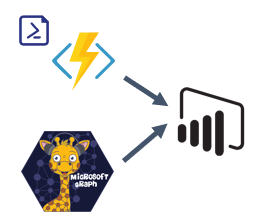

# Security and Management Insights Connector

Microsoft 365 provides several advanced security and management features that empower you to improve your, or your customers, security posture. Knowing what features are configured and whether they adhere to the recommended configurations is challenging. Using this connector, you will be able gain insights what components have been adopted and how they are configured.  

## Architecture

Most of the information required to understand what is configured and the current settings is obtained using Microsoft Graph. However, there is some data that is currently only available through Exchange Online PowerShell. Considering this two Power BI connectors were built for this solution. The `SecMgmtInsights` connector communicates directly with Microsoft Graph and can gather configuration and usage information. Through the `SecMgmtInsights.PowerShell` connector Office 365 ATP information from Exchange Online PowerShell is exposed through an Azure Functions app.

<p align="center">
    
</p>

## Getting Started

### Prerequisites

To leverage each feature available through this solution you will need the following 

- An active Azure subscription for the Azure Functions app
- Privileges to create an Azure Active Directory application

### Installing the module

To simplify the process of creating and configuring the dependent resources for the connect, the [Install-SecMgmtInsightsConnector](https://github.com/microsoft/secmgmt-open-powershell/blob/master/docs/help/Install-SecMgmtInsightsConnector.md) cmdlet has been added to the [Security and Management Open PowerShell module](https://www.powershellgallery.com/packages/SecMgmt). You can leverage the following PowerShell to install the connector on the device invoking the command

```powershell
Install-Module SecMgmt

# When prompt for credentials you will need to specify an account that has the ability to create an Azure Active Directory application.
Connect-SecMgmtAccount

# Use the following if you are planning to gain insights for a single tenant.
Install-SecMgmtInsightsConnector -ApplicationDisplayName 'Security and Management Insights'

# Use the following line if you plan to use the connector to gain insights for customers you have through the Cloud Solution Provider program.
Install-SecMgmtInsightsConnector -ApplicationDisplayName 'Security and Management Insights' -ConfigurePreconsent:$true
```

> When you invoke the above a new Azure Active Directory application will be created, for use with the Security and Management Insights Power BI connector. Then the latest version of the connector is downloaded, configured, and installed on the local device.

The following sections provide details on how to configure and install the connector manually. No further action is required if you invoked the above PowerShell.

#### Azure Active Directory 

This connector utilizes Microsoft Graph and the Office 365 Management API to surface management and security insights for Microsoft 365. Interacting with these APIs requires a native Azure Active Directory application configured with the following permissions

| API | Permissions | Type | Description |
|-----|-------------|------|-------------|
| Microsoft Graph | AuditLog.Read.All | Delegated | Read audit log data |
| Microsoft Graph | DeviceManagementApps.Read.All | Delegated | Read Microsoft Intune apps |
| Microsoft Graph | DeviceManagementConfiguration.Read.All | Delegated | Read Microsoft Intune Device Configuration and Policies |
| Microsoft Graph | DeviceManagementManagedDevices.Read.All | Delegated | Read Microsoft Intune devices |
| Microsoft Graph | DeviceManagementServiceConfig.Read.All | Delegated | Read Microsoft Intune configuration |
| Microsoft Graph | Directory.Read.All | Delegated | Read directory data |
| Microsoft Graph | IdentityRiskyUser.Read.All | Delegated | Read identity risky user information |
| Microsoft Graph | InformationProtectionPolicy.Read | Delegated | Read user sensitivity labels and label policies |
| Microsoft Graph | Policy.Read.All | Delegated | Read your organization's policies |
| Microsoft Graph | Reports.Read.All | Delegated | Read all usage reports |
| Microsoft Graph | SecurityEvents.Read.All | Delegated | Read your organization’s security events |
| Microsoft Graph | User.Read | Delegated |  Sign in and read user profile |
| Office 365 Management API | ActivityFeed.Read | Delegated | Read activity data for your organization |
| Office 365 Management API | ActivityFeed.ReadDlp | Delegated | Read DLP policy events including detected sensitive data |
| Office 365 Management API | ServiceHealth.Read | Delegated | Read service health information for your organization |

#### Extension configuration

Prior to using the connector you will need to modify the client identifier used for authentication. Perform the following to update the value

1. Download the latest release available [here](https://aka.ms/secmgmt-insights-connector/latest)
2. Unblock the zip file and extract the contents
3. Replace the GUID in the *client_id* with the application identifier
4. Add the *client_id* file to the *SecMgmtInsights.zip* archive
5. Rename the *SecMgmtInsights.zip* file to *SecMgmtInsights.mez*
6. Copy the *SecMgmtInsights.mez* into the *[Documents]\Microsoft Power BI Desktop\Custom Connectors* directory


The extension provided through the [releases](https://github.com/microsoft/secmgmt-insights-connector/releases) page, is not signed because you will need to insert the client identifier for the Azure Active Directory application create using the above process. To perform this process start Power BI Desktop and then perform the following

1. Click file -> options and settings -> options
2. Click security under the global section
3. Click *(Not Recommended) Allow any extension to load without validation or warning*

Once you have finished testing you can sign the extension and reset this configuration. See [handling Power Query connector signing](https://docs.microsoft.com/power-query/HandlingConnectorSigning) for more information.

## Contributing

This project welcomes contributions and suggestions.  Most contributions require you to agree to a Contributor License Agreement (CLA) declaring that you have the right to, and actually do, grant us the rights to use your contribution. For details, visit <https://cla.opensource.microsoft.com>.

When you submit a pull request, a CLA bot will automatically determine whether you need to provide a CLA and decorate the PR appropriately (e.g., status check, comment). Simply follow the instructions provided by the bot. You will only need to do this once across all repos using our CLA.

This project has adopted the [Microsoft Open Source Code of Conduct](https://opensource.microsoft.com/codeofconduct/). For more information see the [Code of Conduct FAQ](https://opensource.microsoft.com/codeofconduct/faq/) or contact [opencode@microsoft.com](mailto:opencode@microsoft.com) with any additional questions or comments.
